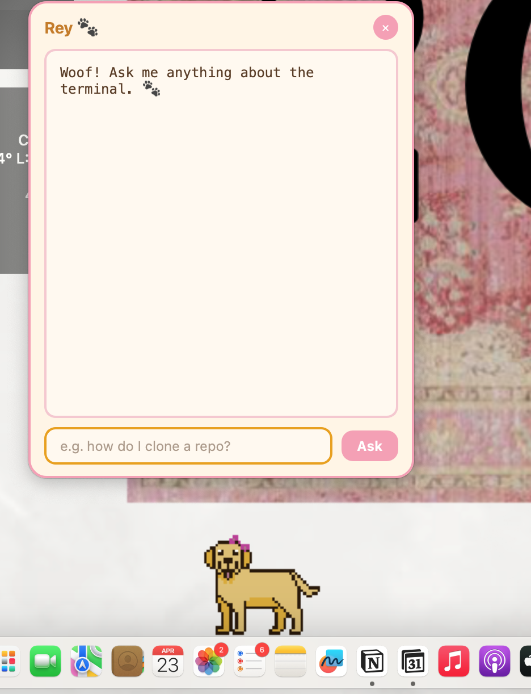

# Rey — Your Terminal Companion 🐾

Rey is a desktop AI assistant for macOS that lives above your dock as an animated pixel art golden retriever. Click her anytime you have a terminal question and she'll answer in plain, beginner-friendly English.



---

## Inspiration

This project is dedicated to my late golden retriever, Rey — the sweetest, most loyal dog. She now lives on my dock, ready to help whenever I need her. 🐾

The idea for a character that walks across the dock was inspired by [lil agents](https://github.com/ryanstephen/lil-agents) by [@ryanstephen](https://github.com/ryanstephen) — a beautifully crafted macOS app built in Swift. I loved the concept so much that I reimagined it from scratch in Python, building my own transparent window system, sprite animation, and AI integration.

---

## Who is Rey for?

Rey is built for **beginner programmers** who are still getting comfortable with the terminal and command line. Instead of digging through documentation or Stack Overflow every time you forget a command, you can just click Rey and ask in plain English:

- *"How do I clone a repo?"*
- *"What does `ls -la` do?"*
- *"How do I delete a file?"*
- *"How do I undo my last git commit?"*

Rey explains the exact command you need and what it does — no jargon, no judgment.

---

## Features

- 🐕 Animated pixel art golden retriever that walks across your dock
- 💬 Click to open a chat popup and ask any terminal question
- 🤖 Powered by Claude (Anthropic) for friendly, accurate answers
- 🎨 Soft gold and pink UI designed to match Rey's colours
- 🔄 Stays visible across all apps and spaces

---

## Setup

### Requirements
- macOS
- Python 3.9+
- An [Anthropic API key](https://console.anthropic.com)

### Installation

```bash
# Clone the repo
git clone https://github.com/bennarah/Rey-Terminal-Assitant.git
cd Rey-Terminal-Assitant/rey

# Create and activate a virtual environment
python3 -m venv venv
source venv/bin/activate

# Install dependencies
pip install -r requirements.txt
```

### Configuration

Create a `.env` file in the `rey/` folder:

```
ANTHROPIC_API_KEY=your_api_key_here
```

### Run

```bash
python main.py
```

Rey will appear above your dock. Click her to start chatting!

---

## Tech Stack

- **Python** — core language
- **PySide6** — transparent desktop window and UI
- **Anthropic API (Claude Haiku)** — AI brain
- **Pixel art** — hand-drawn in [Piskel](https://www.piskelapp.com)

---

## Project Structure

```
rey/
├── main.py           # Main application
├── New Piskel.png    # Rey's sprite sheet (5 walking frames)
├── requirements.txt  # Python dependencies
├── .env              # Your API key (never committed)
└── .gitignore
```

---

*In memory of Rey — good girl forever.* 🐾
